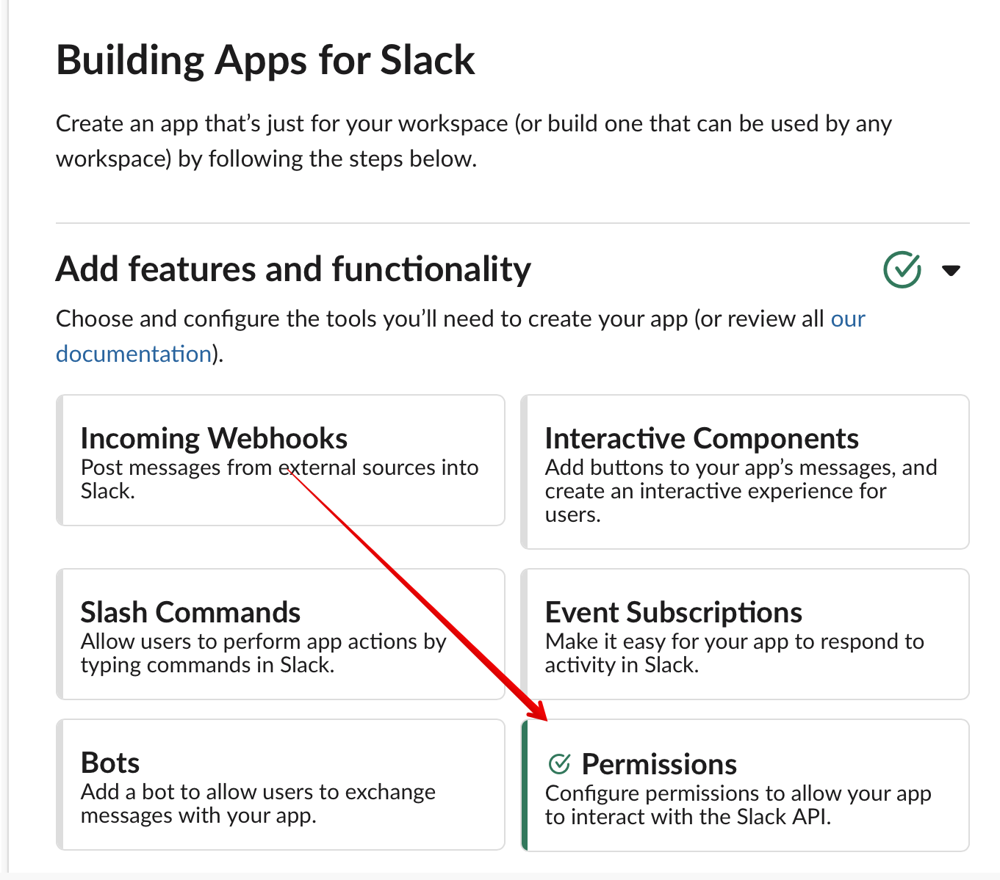
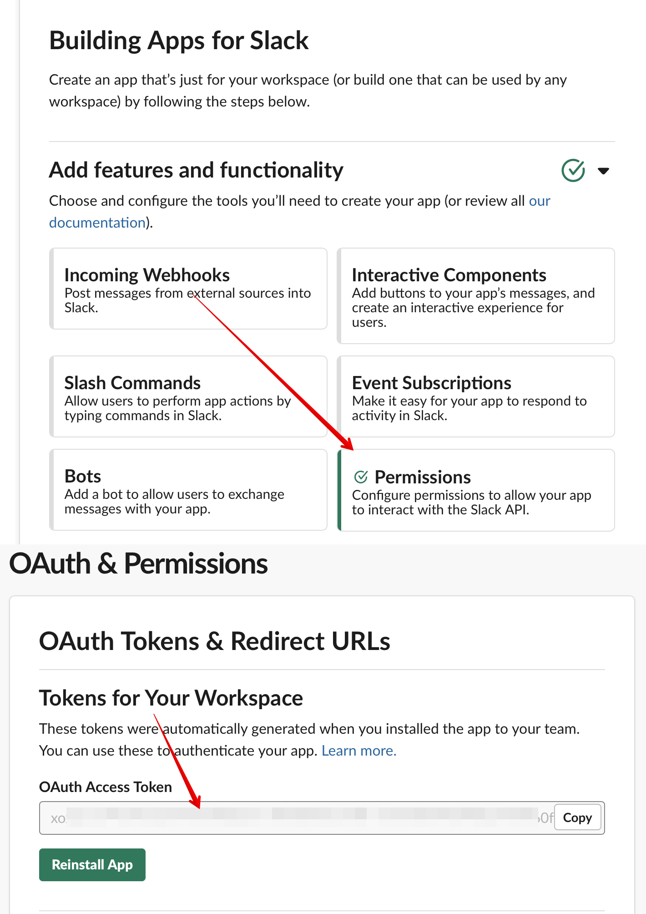

# Token Generation Instructions

1. Visit https://api.slack.com/apps
2. If you have already created your app then click on it, otherwise create a new app.
3. Click on "Add features and functionality" to expand that section
4. Click on "Permissions"

   

5. Copy the "OAuth Access Token"

   

Note: The Elixir Slack library only uses the "OAuth Access Token" or "Bot User OAuth Access Token", it does not use the "Client ID", "Client Secret", "Signing Secret", or "Verification Token".
